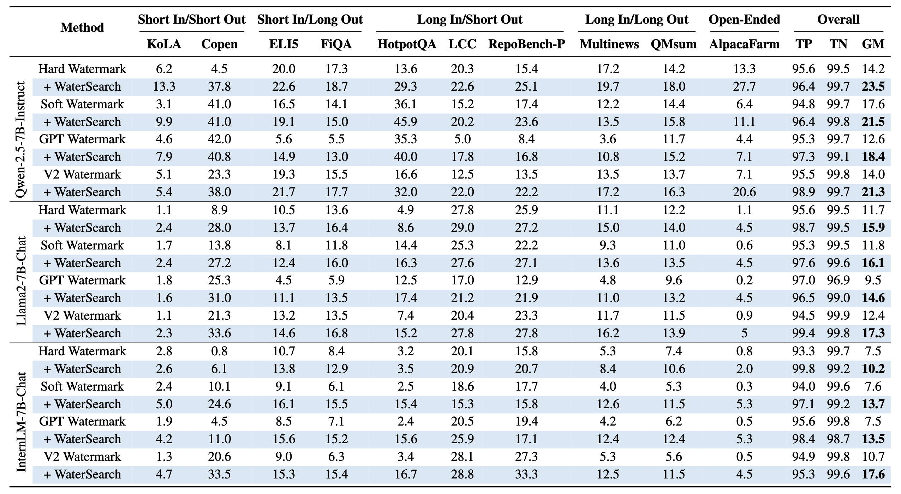
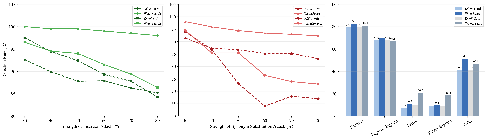
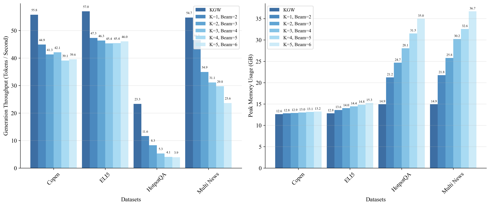

# <p align="center"> WaterSearch: A Quality-Aware Search-based Watermarking Framework for Large Language Models


This is the official repo for "[WaterSearch: A Quality-Aware Search-based Watermarking Framework for Large Language Models](https://www.arxiv.org/abs/2512.00837)".

## Overview of WaterSearch: A Parallel Searching Watermark Framework


> WaterSearch Framework.

Watermarking acts as a critical safeguard for ensuring accountability, authenticity, and trust in text generated by Large Language Models (LLMs). By embedding identifiable signals into model outputs, watermarking enables reliable attribution and enhances the security of machine-generated content. Existing approaches typically embed signals by manipulating token generation probabilities, with detection achieved by computation of corresponding statistical metrics. Despite their effectiveness, these methods inherently face a trade-off between detectability and text quality: the signal strength and randomness required for robust watermarking tend to degrade the performance of downstream tasks.

In this paper, we design a novel embedding scheme that controls seed pools to facilitate diverse parallel generation of watermarked text. Based on that scheme, we propose WaterSearch, a sentence-level, search-based watermarking framework adaptable to a wide range of existing methods. WaterSearch enhances text quality by jointly optimizing two key aspects: 1) distribution fidelity and 2) watermark signal characteristics. Furthermore, WaterSearch is complemented by a sentence-level detection method with strong attack robustness. We evaluate our method on three popular LLMs across ten diverse tasks. Extensive experiments demonstrate that our method achieves an average performance improvement of 51.01\% over state-of-the-art baselines at a watermark detectability strength of 95\%. In challenging scenarios such as short text generation and low-entropy output generation, our method yields performance gains of 47.78\% and 36.47\%, respectively. Moreover, under different attack senarios including insertion, synonym substitution and paraphrase attasks, WaterSearch maintains high detectability, further validating its robust anti-attack capabilities.

## Performance

> Main results.


> Against different attacks.


> Computation cost.

## How to Run?

### Installation
1. Clone this repository:

```
git clone https://github.com/Yukang-Lin/WaterSearch.git
```

2. Create a virtual environment (we use python3.13.5), and then install dependencies:
```
pip install -r requirements.txt

cd ./transformers

pip install -e .
```

### Try Baseline Methods
For **Generation**
```
bash scripts/pred_baseline.sh
```

For **Detection**
```
bash scirpts/detect_baseline.sh
```

### Try WaterSearch
For **Generation**
```
bash scripts/pred_watersearch.sh
```

For **Detection**
```
bash scirpts/detect_watersearch.sh
```

### For Quality Evaluation 
```
bash scripts/eval.sh
```

### Acknowledgement
Our code is build upon [WaterBench](https://github.com/THU-KEG/WaterBench). We use [MarkLLM](https://github.com/THU-BPM/MarkLLM) for token-level attacks and [SimMark](https://github.com/DabiriAghdam/SimMark) for paraphrase attacks.

## Citation

If you found this repository helpful, please don't forget to cite our paper:
```
@misc{lin2025watersearchqualityawaresearchbasedwatermarking,
      title={WaterSearch: A Quality-Aware Search-based Watermarking Framework for Large Language Models}, 
      author={Yukang Lin and Jiahao Shao and Shuoran Jiang and Wentao Zhu and Bingjie Lu and Xiangping Wu and Joanna Siebert and Qingcai Chen},
      year={2025},
      eprint={2512.00837},
      archivePrefix={arXiv},
      primaryClass={cs.CL},
      url={https://arxiv.org/abs/2512.00837}, 
}

```
If you have any questions, please feel free to contact [Yukang.Lin00@gmail.com](Yukang.Lin00@gmail.com)
